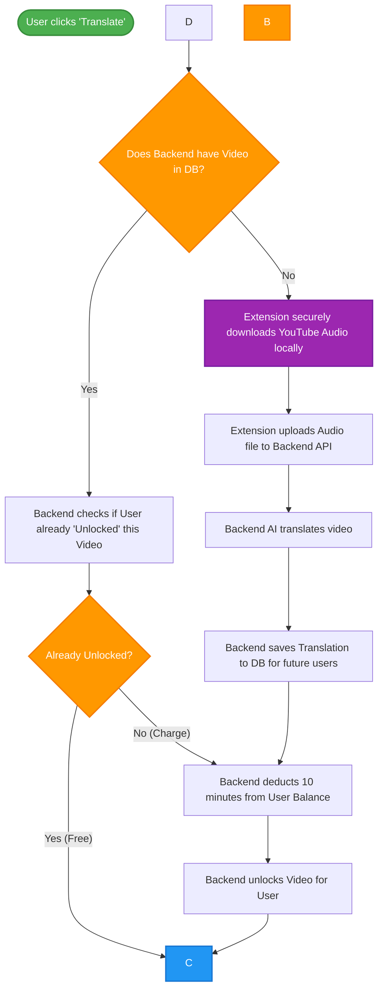

# System Architecture & Flow Document

This document outlines the complete end-to-end architecture for the YouTube Subtitle Extension, combining **Client-Side Audio Extraction** (to bypass YouTube IP bans) with the **Backend "Unlock" Database Model** (for billing and caching). for this case we will deduct the
minutes from the apikey through endpoint(might be same i will provide currently it only deducts when audio processed through it)

In this user is basically a API key,
---

When a user requests a video, they pay via "API Minutes(platform api key will handle)". 
- If the video is **new**, the extension downloads the audio securely on the user's browser, uploads it to the backend, and the backend processes and saves it. 
- If the video is **already processed** by anyone else, the user is charged to "unlock" the translation for their account, and the data is delivered instantly without reprocessing.

---

## 2. Step-by-Step User Flowchart

Below is a simple, step-by-step flowchart of what happens when a user attempts to translate a video.

---

## 3. Database Schema Design (Backend tables)

To securely track balances and prevent double-charging users for previously unlocked content, your relational database requires 4 core tables:

### 1. `Users` Table
| Column Name | Type | Description |
|---|---|---|
| `id` | UUID (PK) | Unique user identifier |
| `api_key` | String | The key used in the extension |
| `available_minutes`| Float | Total balance of minutes (e.g. 60.5) |

### 2. `Videos` Table
| Column Name | Type | Description |
|---|---|---|
| `id` | UUID (PK) | Internal ID |
| `youtube_id` | String | e.g., "dQw4w9WgXcQ" |
| `duration_minutes` | Float | e.g., 10.0 |

### 3. `Transcriptions` Table (Centralized Cache)
| Column Name | Type | Description |
|---|---|---|
| `id` | UUID (PK) | Internal ID |
| `video_id` | UUID (FK) | Reference to `Videos` table |
| `language` | String | Target language (e.g., "ps" or "ba") |
| `segments_json` | JSONB | The actual array of translated text |

### 4. `User_Unlocked_Videos` Table (Billing Prevention)
| Column Name | Type | Description |
|---|---|---|
| `id` | UUID (PK) | Internal ID |
| `user_id` | UUID (FK) | Reference to `Users` table |
| `video_id` | UUID (FK) | Reference to `Videos` table |
| `language` | String | The target language unlocked |
| `unlocked_at` | Timestamp | Standard logging |

---

## 4. Backend API Endpoints

### Endpoint 1: Checking for Caches & Unlocks
`GET /v1/youtube/check?videoId=ABC&lang=ps`
*Headers: `x-api-key: <user_key>`*

**Logic:**
1. Is `videoId` + `user_id(IT will be APi key)` inside `User_Unlocked_Videos`? **Yes -> Return segments. No charge.**
2. Is `videoId` inside `Transcriptions` globally? **Yes -> Check user balance, deduct minutes, inert to `User_Unlocked_Videos`, and return segments.**
3. Is `videoId` NOT inside `Transcriptions`? **No -> Return `{ status: "requires_audio" }`.**

### Endpoint 2: Processing New Files
`POST /v1/youtube/upload-audio` 
*Headers: `x-api-key: <user_key>`*
*Body: `FormData` (audioFile: video_audio.webm, videoId: ABC, lang: ps)*

**Logic:**
1. Check user balance based on video duration.
2. Run `Whisper` / `M2M100` on the `.webm` file.
3. Save result to `Transcriptions`, deduct balance on `Users`, add row to `User_Unlocked_Videos`.
4. Return segments to extension.
